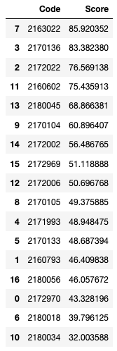

Se califican las predicciones hechas por estudiantes para las muertes covid de septiembre 2021.

* ``code:`` Notebooks para calculos.
* ``data:`` Datos para usar en los notebooks.
* ``inputs:`` Predicciones hechas por los estudiantes.
* ``outputs:`` Resultados (Tabla) obtenida con los scores de las predicciones.

# Resultados:

